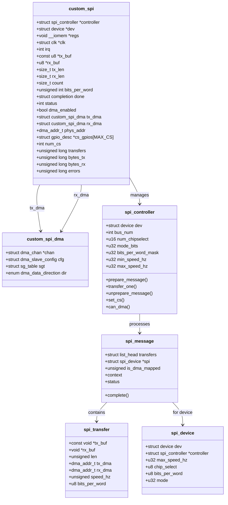
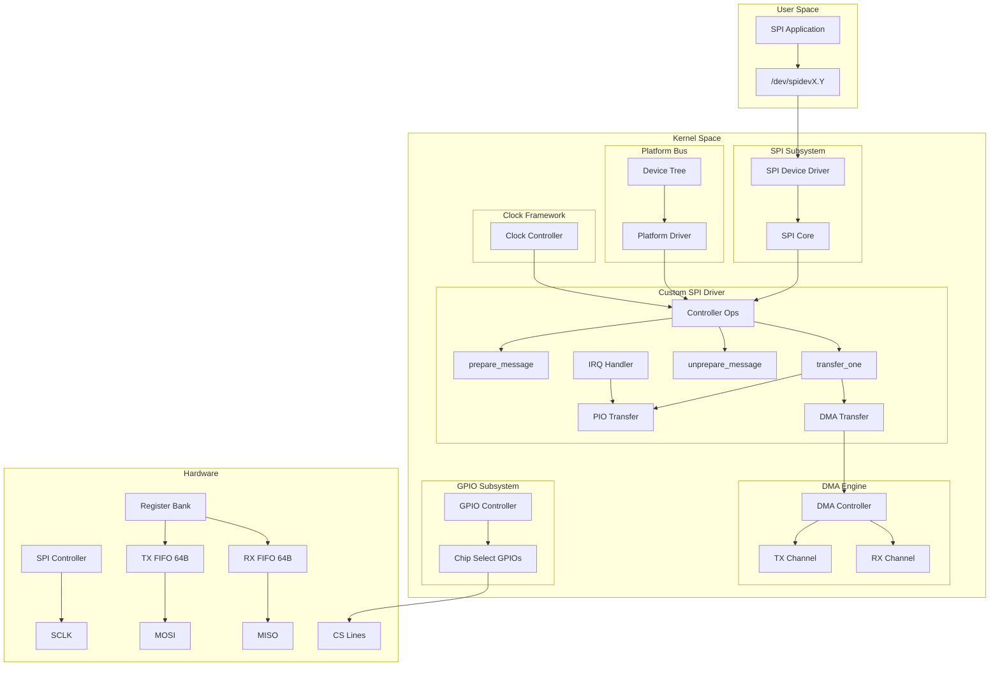
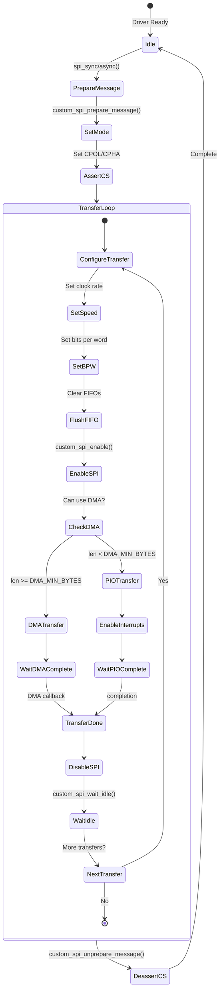
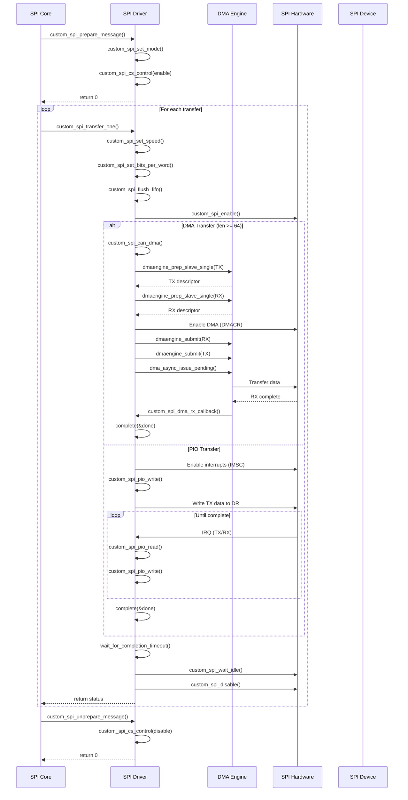
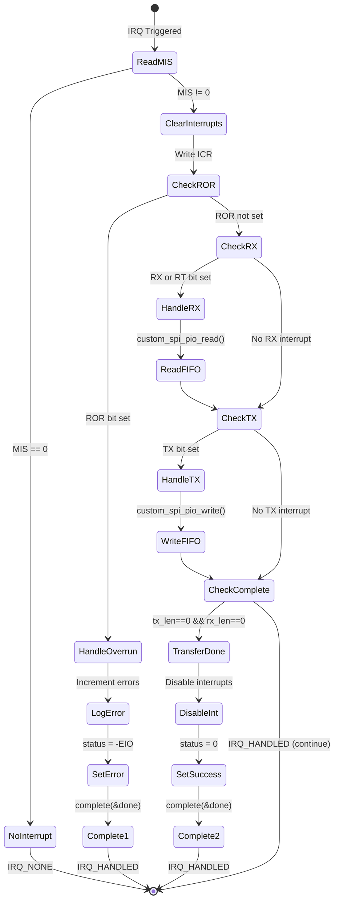
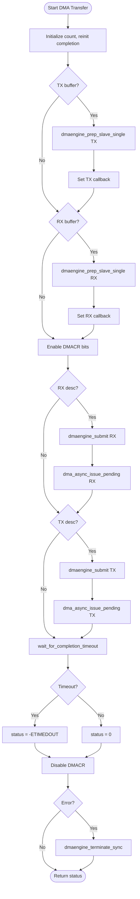
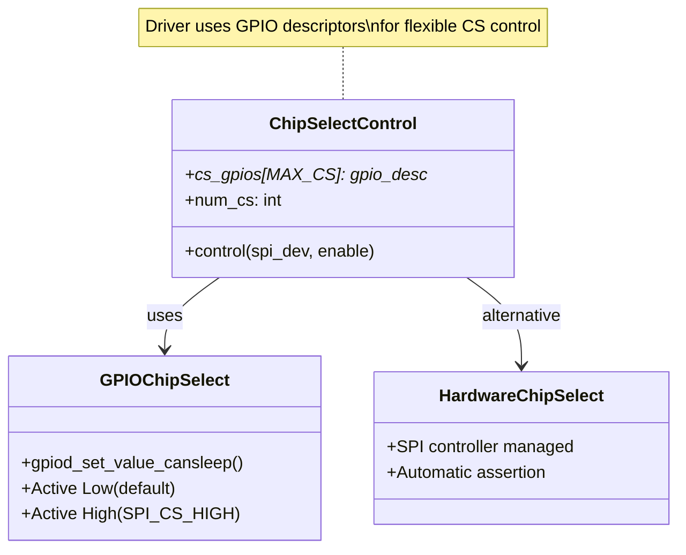
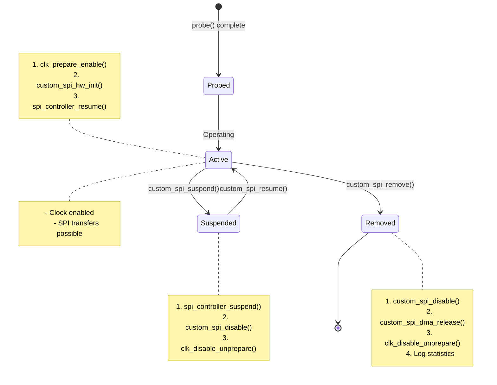
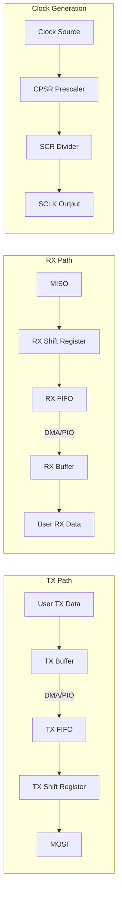

# Custom SPI Controller Driver - UML Documentation

## Overview

The Custom SPI driver is a full-featured SPI master controller driver that integrates with the Linux SPI core framework. It demonstrates interrupt-driven and DMA transfers with GPIO-based chip select support.

**Driver Type:** Platform Device SPI Controller Driver
**File:** `drivers/peripheral/spi/custom_spi.c`
**Subsystems:** SPI Core, DMA Engine, GPIO, Clock, PM Runtime

---

## 1. Class Diagram (Data Structures)



---

## 2. Component Diagram (System Architecture)



---

## 3. Register Map Diagram

```
SPI Controller Register Map:

Offset  Name    R/W   Description
────────────────────────────────────────────────────────
0x00    CR0     R/W   Control Register 0
0x04    CR1     R/W   Control Register 1
0x08    DR      R/W   Data Register (FIFO access)
0x0C    SR      R     Status Register
0x10    CPSR    R/W   Clock Prescale Register
0x14    IMSC    R/W   Interrupt Mask Set/Clear
0x18    RIS     R     Raw Interrupt Status
0x1C    MIS     R     Masked Interrupt Status
0x20    ICR     W     Interrupt Clear Register
0x24    DMACR   R/W   DMA Control Register

┌─────────────────────────────────────────────────────────┐
│                    CR0 (0x00)                           │
├────────────────────────────────────────────────────────┤
│ [15:8]   SCR    - Serial Clock Rate (0-255)            │
│ [7]      SPH    - Clock Phase (0=first edge, 1=second) │
│ [6]      SPO    - Clock Polarity (0=low, 1=high idle)  │
│ [5:4]    FRF    - Frame Format (00=SPI, 01=TI, 10=MW)  │
│ [3:0]    DSS    - Data Size Select (bits-1, 0011-1111) │
└────────────────────────────────────────────────────────┘

┌─────────────────────────────────────────────────────────┐
│                    CR1 (0x04)                           │
├────────────────────────────────────────────────────────┤
│ [3]      SOD    - Slave Output Disable                 │
│ [2]      MS     - Master/Slave (0=Master, 1=Slave)     │
│ [1]      SSE    - SPI Enable (1=Enabled)               │
│ [0]      LBM    - Loopback Mode                        │
└────────────────────────────────────────────────────────┘

┌─────────────────────────────────────────────────────────┐
│                    SR (0x0C)                            │
├─────┬─────┬─────┬─────┬─────────────────────────────────┤
│  4  │  3  │  2  │  1  │  0                              │
├─────┼─────┼─────┼─────┼─────────────────────────────────┤
│ BSY │ RFF │ RNE │ TNF │ TFE                             │
│Busy │RX   │RX   │TX   │TX FIFO                          │
│     │Full │Not  │Not  │Empty                            │
│     │     │Empty│Full │                                 │
└─────┴─────┴─────┴─────┴─────────────────────────────────┘

┌─────────────────────────────────────────────────────────┐
│                    IMSC/RIS/MIS/ICR                     │
├─────┬─────┬─────┬─────┬─────────────────────────────────┤
│  3  │  2  │  1  │  0  │                                 │
├─────┼─────┼─────┼─────┼─────────────────────────────────┤
│ TX  │ RX  │ RT  │ ROR │                                 │
│FIFO │FIFO │RX   │RX   │                                 │
│Half │Half │Time │Over │                                 │
│Empty│Full │out  │run  │                                 │
└─────┴─────┴─────┴─────┴─────────────────────────────────┘
```

---

## 4. SPI Mode Configuration

```
SPI Modes (CPOL/CPHA Configuration):

Mode 0 (CPOL=0, CPHA=0):
        ┌───┐   ┌───┐   ┌───┐   ┌───┐
SCLK ───┘   └───┘   └───┘   └───┘   └───
        ↑       ↑       ↑       ↑
    Sample   Sample  Sample  Sample

Mode 1 (CPOL=0, CPHA=1):
        ┌───┐   ┌───┐   ┌───┐   ┌───┐
SCLK ───┘   └───┘   └───┘   └───┘   └───
            ↑       ↑       ↑       ↑
         Sample  Sample  Sample  Sample

Mode 2 (CPOL=1, CPHA=0):
    ────┐   ┌───┐   ┌───┐   ┌───┐   ┌───
SCLK    └───┘   └───┘   └───┘   └───┘
        ↑       ↑       ↑       ↑
    Sample   Sample  Sample  Sample

Mode 3 (CPOL=1, CPHA=1):
    ────┐   ┌───┐   ┌───┐   ┌───┐   ┌───
SCLK    └───┘   └───┘   └───┘   └───┘
            ↑       ↑       ↑       ↑
         Sample  Sample  Sample  Sample

┌─────────────────────────────────────────────────────┐
│  Mode  │  CPOL  │  CPHA  │  CR0[SPO]  │  CR0[SPH]  │
├────────┼────────┼────────┼────────────┼────────────┤
│   0    │   0    │   0    │     0      │     0      │
│   1    │   0    │   1    │     0      │     1      │
│   2    │   1    │   0    │     1      │     0      │
│   3    │   1    │   1    │     1      │     1      │
└────────┴────────┴────────┴────────────┴────────────┘
```

---

## 5. Transfer State Machine



---

## 6. Sequence Diagram (Full Transfer)



---

## 7. IRQ Handler State Diagram



---

## 8. Clock Configuration

```
SPI Clock Calculation:

                      SPI_CLK
    SCLK = ─────────────────────────
            CPSR × (1 + SCR)

    Where:
    - SPI_CLK = Input clock frequency
    - CPSR = Clock Prescale (2-254, even only)
    - SCR = Serial Clock Rate (0-255)

    Minimum SCLK = SPI_CLK / (254 × 256)
    Maximum SCLK = SPI_CLK / 2

Algorithm to find CPSR and SCR:
┌──────────────────────────────────────────────────────┐
│  for cpsr = 2; cpsr <= 254; cpsr += 2:               │
│      scr = (SPI_CLK / (cpsr × target_speed)) - 1     │
│      if scr <= 255:                                  │
│          break  // Found valid combination           │
│                                                      │
│  Actual speed = SPI_CLK / (cpsr × (1 + scr))         │
└──────────────────────────────────────────────────────┘

Example (10 MHz target with 100 MHz clock):
    CPSR = 2, SCR = 4
    SCLK = 100MHz / (2 × 5) = 10 MHz
```

---

## 9. PIO Transfer Flow

```mermaid
flowchart TD
    subgraph Write["PIO Write"]
        W_START([Start Write]) --> W_CHECK{tx_len > 0?}
        W_CHECK -->|No| W_DONE([Done])
        W_CHECK -->|Yes| W_FIFO{TNF set?}
        W_FIFO -->|No| W_DONE
        W_FIFO -->|Yes| W_DATA{tx_buf valid?}
        W_DATA -->|Yes 8-bit| W_READ8[Read *tx_buf++]
        W_DATA -->|Yes 16-bit| W_READ16[Read *(u16*)tx_buf]
        W_DATA -->|No| W_ZERO[val = 0]
        W_READ8 --> W_WRITE
        W_READ16 --> W_WRITE
        W_ZERO --> W_WRITE
        W_WRITE[Write DR] --> W_DEC[tx_len--, count++]
        W_DEC --> W_CHECK
    end

    subgraph Read["PIO Read"]
        R_START([Start Read]) --> R_CHECK{rx_len > 0?}
        R_CHECK -->|No| R_DONE([Done])
        R_CHECK -->|Yes| R_FIFO{RNE set?}
        R_FIFO -->|No| R_DONE
        R_FIFO -->|Yes| R_READ[Read DR]
        R_READ --> R_BUF{rx_buf valid?}
        R_BUF -->|Yes 8-bit| R_STORE8[*rx_buf++ = val]
        R_BUF -->|Yes 16-bit| R_STORE16[*(u16*)rx_buf = val]
        R_BUF -->|No| R_DISCARD[Discard]
        R_STORE8 --> R_DEC
        R_STORE16 --> R_DEC
        R_DISCARD --> R_DEC
        R_DEC[rx_len--] --> R_CHECK
    end
```

---

## 10. DMA Transfer Flow



---

## 11. Chip Select Control



```
Chip Select Timing:

CS (Active Low):
    ──────┐                                      ┌──────
          └──────────────────────────────────────┘
          ↑                                      ↑
    Assert CS                              Deassert CS
    (prepare_message)                    (unprepare_message)

           ┌─────────────────────────────────┐
    SCLK ──┤  Clock during transfer          ├─────
           └─────────────────────────────────┘

           ┌─────────────────────────────────┐
    MOSI ──┤  TX Data                        ├─────
           └─────────────────────────────────┘

           ┌─────────────────────────────────┐
    MISO ──┤  RX Data                        ├─────
           └─────────────────────────────────┘

GPIO Control Logic:
┌───────────────────────────────────────────────────────┐
│  if (mode & SPI_CS_HIGH)                              │
│      gpiod_set_value(cs, enable ? 1 : 0);  // Active high │
│  else                                                 │
│      gpiod_set_value(cs, enable ? 0 : 1);  // Active low  │
└───────────────────────────────────────────────────────┘
```

---

## 12. Activity Diagram (Probe Function)

```mermaid
flowchart TD
    START([Start Probe]) --> ALLOC[devm_spi_alloc_host]
    ALLOC --> GET_DATA[spi_controller_get_devdata]
    GET_DATA --> INIT_COMP[init_completion]

    INIT_COMP --> GET_MEM[platform_get_resource MEM]
    GET_MEM --> IOREMAP[devm_ioremap_resource]
    IOREMAP --> CHECK_MAP{Mapping OK?}
    CHECK_MAP -->|No| ERROR1[Return error]
    CHECK_MAP -->|Yes| GET_CLK[devm_clk_get]

    GET_CLK --> CHECK_CLK{Clock OK?}
    CHECK_CLK -->|No| ERROR2[Return error]
    CHECK_CLK -->|Yes| GET_IRQ[platform_get_irq]

    GET_IRQ --> CHECK_IRQ{IRQ valid?}
    CHECK_IRQ -->|No| ERROR3[Return error]
    CHECK_IRQ -->|Yes| GET_CS[Get CS GPIOs]

    GET_CS --> LOOP_CS[Loop: devm_gpiod_get_index_optional]
    LOOP_CS --> ENABLE_CLK[clk_prepare_enable]

    ENABLE_CLK --> HW_INIT[custom_spi_hw_init]
    HW_INIT --> REQ_IRQ[devm_request_irq]

    REQ_IRQ --> CHECK_IRQREQ{IRQ request OK?}
    CHECK_IRQREQ -->|No| DISABLE_CLK[clk_disable_unprepare]
    DISABLE_CLK --> ERROR4[Return error]
    CHECK_IRQREQ -->|Yes| DMA_INIT[custom_spi_dma_init]

    DMA_INIT --> CONFIG_CTRL[Configure spi_controller]

    CONFIG_CTRL --> SET_BUS[bus_num = pdev->id]
    SET_BUS --> SET_CS[num_chipselect = num_cs]
    SET_CS --> SET_MODE[mode_bits = CPOL|CPHA|CS_HIGH|LSB]
    SET_MODE --> SET_BPW[bits_per_word_mask = 4-16]
    SET_BPW --> SET_SPEED[min/max_speed_hz]
    SET_SPEED --> SET_OPS[Set operation callbacks]

    SET_OPS --> REGISTER[devm_spi_register_controller]
    REGISTER --> CHECK_REG{Register OK?}
    CHECK_REG -->|No| DMA_RELEASE[custom_spi_dma_release]
    DMA_RELEASE --> DISABLE_CLK2[clk_disable_unprepare]
    DISABLE_CLK2 --> ERROR5[Return error]
    CHECK_REG -->|Yes| LOG[dev_info: Controller registered]

    LOG --> SUCCESS([Return 0])

    ERROR1 --> FAIL([Return error])
    ERROR2 --> FAIL
    ERROR3 --> FAIL
    ERROR4 --> FAIL
    ERROR5 --> FAIL
```

---

## 13. Power Management States



---

## 14. Device Tree Binding

```
Device Tree Example:

spi0: spi@20000000 {
    compatible = "vendor,custom-spi";
    reg = <0x20000000 0x1000>;
    interrupts = <GIC_SPI 20 IRQ_TYPE_LEVEL_HIGH>;
    clocks = <&spi_clk>;
    cs-gpios = <&gpio 8 GPIO_ACTIVE_LOW>,
               <&gpio 7 GPIO_ACTIVE_LOW>;
    dmas = <&dma 2>, <&dma 3>;
    dma-names = "tx", "rx";
    #address-cells = <1>;
    #size-cells = <0>;

    flash@0 {
        compatible = "jedec,spi-nor";
        reg = <0>;
        spi-max-frequency = <40000000>;
    };

    sensor@1 {
        compatible = "vendor,sensor";
        reg = <1>;
        spi-max-frequency = <1000000>;
        spi-cpol;
        spi-cpha;
    };
};

┌─────────────────────────────────────────────────────────┐
│                    Device Tree Node                     │
├─────────────────────────────────────────────────────────┤
│  compatible: "vendor,custom-spi"                        │
│                                                         │
│  ┌─────────────┬───────────────────────────────────┐    │
│  │  Property   │  Description                      │    │
│  ├─────────────┼───────────────────────────────────┤    │
│  │  reg        │  Register base and size           │    │
│  │  interrupts │  IRQ specification                │    │
│  │  clocks     │  Reference to SPI clock           │    │
│  │  cs-gpios   │  Chip select GPIO list            │    │
│  │  dmas       │  TX and RX DMA channel refs       │    │
│  │  dma-names  │  "tx", "rx"                       │    │
│  └─────────────┴───────────────────────────────────┘    │
│                                                         │
│  Kconfig Options:                                       │
│  - CONFIG_SPI_CUSTOM              (tristate)            │
│  - CONFIG_SPI_CUSTOM_DMA          (bool)                │
│  - CONFIG_SPI_CUSTOM_DMA_MIN_BYTES (int, default 64)    │
│  - CONFIG_SPI_CUSTOM_DEBUG        (bool)                │
│  - CONFIG_SPI_CUSTOM_MAX_CHIPSELECT (int, default 4)    │
└─────────────────────────────────────────────────────────┘
```

---

## 15. Data Flow Summary



---

## Summary

The Custom SPI driver demonstrates:

1. **SPI Core Integration** - Standard Linux SPI framework
2. **Controller Operations** - prepare/transfer/unprepare callbacks
3. **PIO Transfers** - Interrupt-driven FIFO management
4. **DMA Transfers** - High-performance scatter-gather
5. **GPIO Chip Select** - Flexible multi-device support
6. **Clock Management** - Dynamic frequency configuration
7. **SPI Modes** - All CPOL/CPHA combinations
8. **Power Management** - Suspend/resume support
9. **Device Tree** - Flexible hardware configuration
10. **Error Handling** - Overrun detection and recovery
