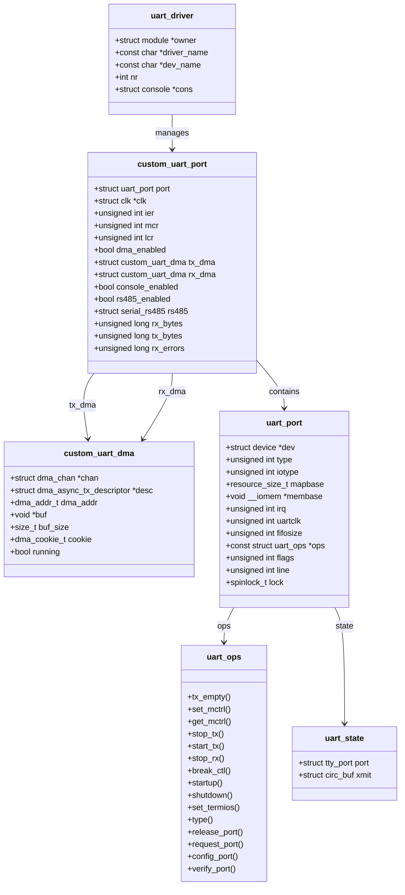
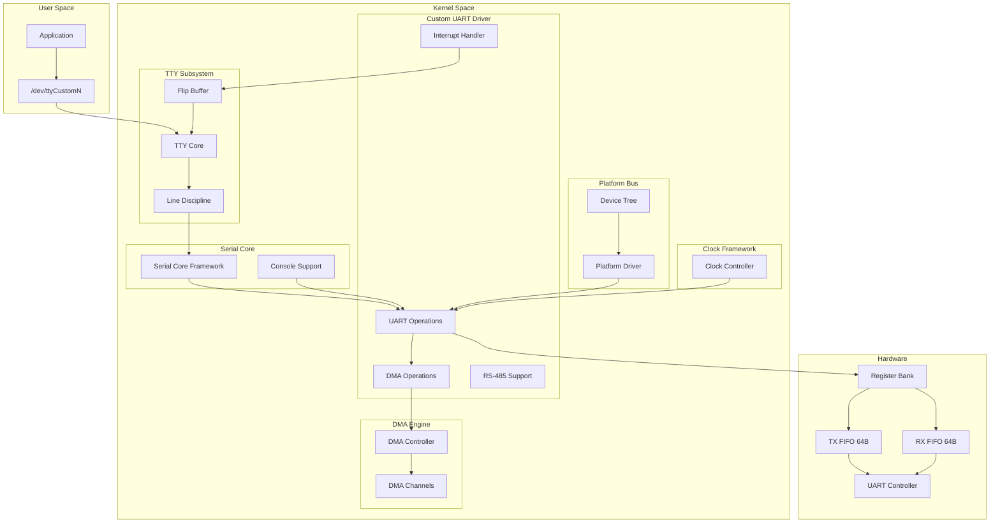
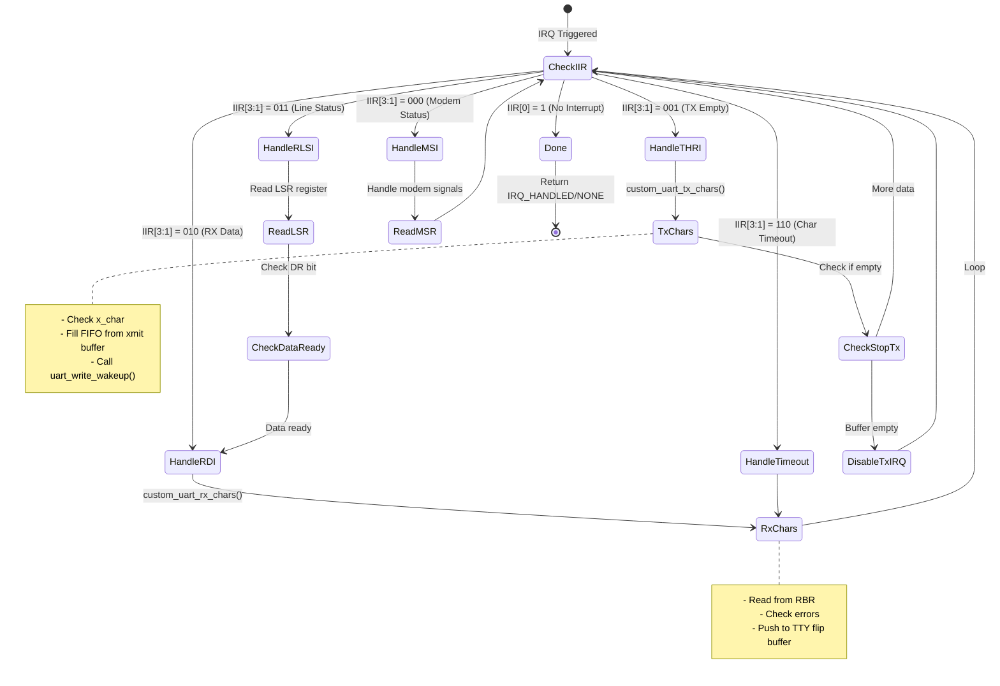
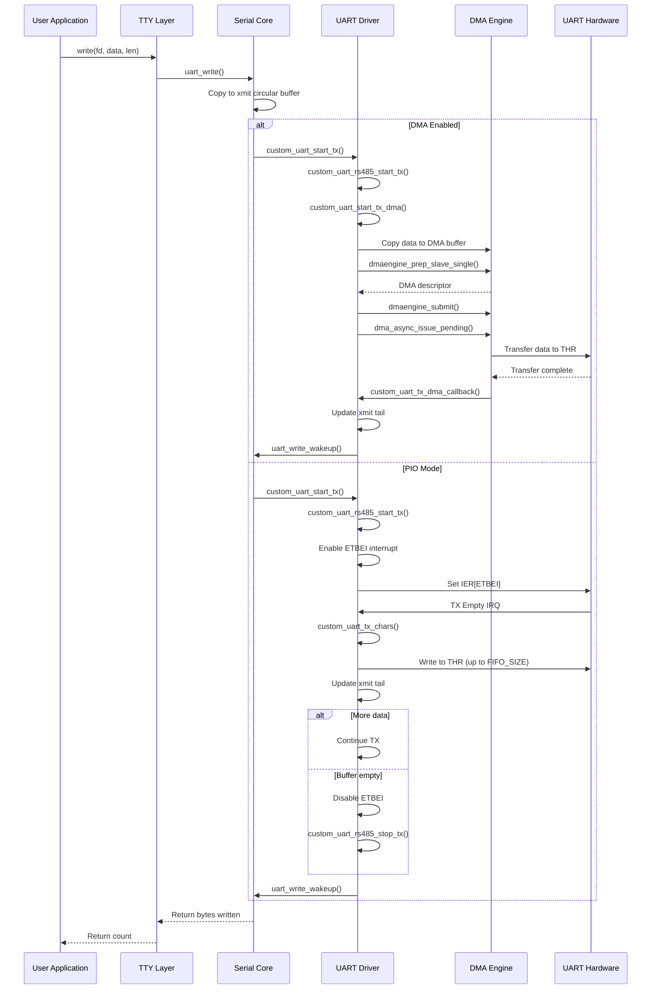
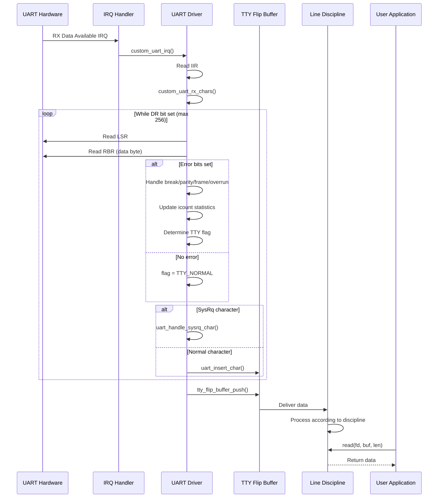
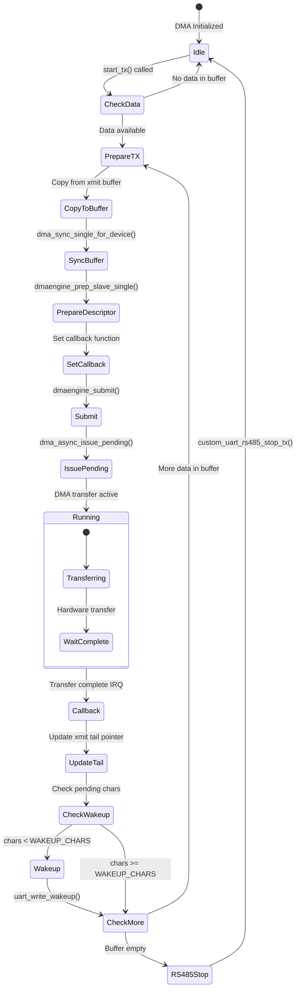
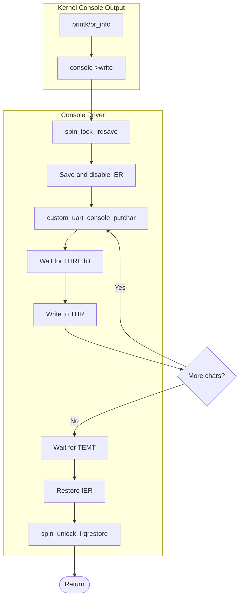
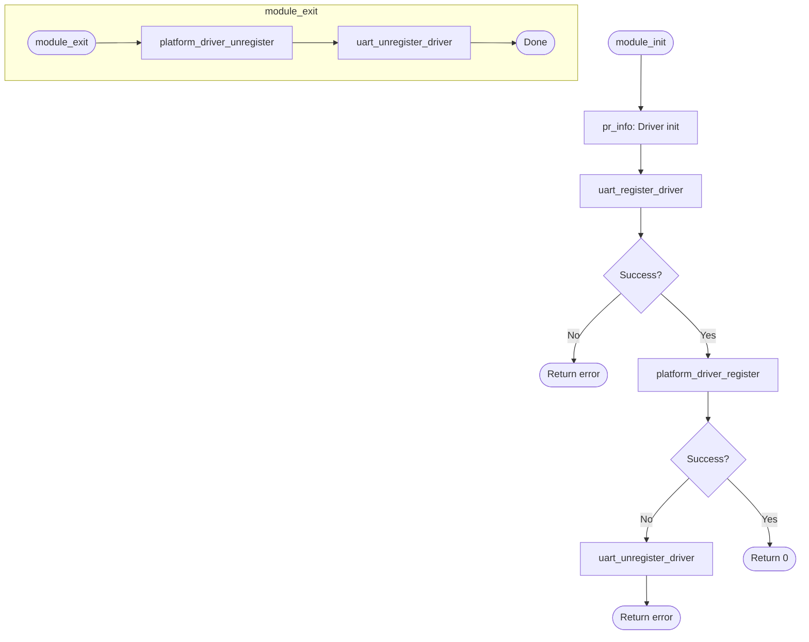
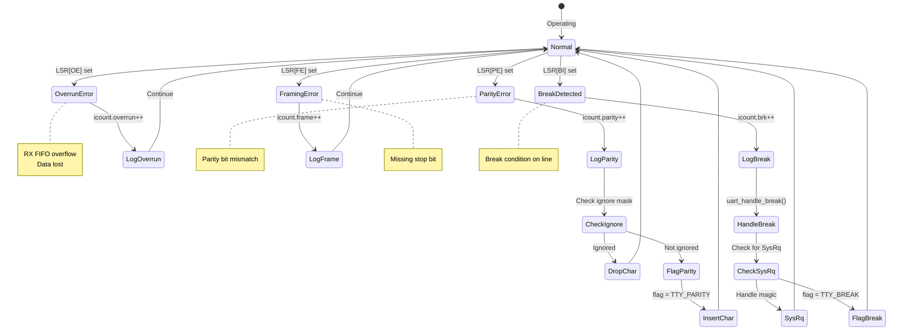

# Custom UART Controller Driver - UML Documentation

## Overview

The Custom UART driver is a full-featured UART/Serial controller driver that integrates with the Linux TTY and Serial Core subsystems. It demonstrates a complete implementation similar to 16550/8250 UART controllers.

**Driver Type:** Platform Device UART Controller Driver
**File:** `drivers/peripheral/uart/custom_uart.c`
**Subsystems:** TTY, Serial Core, DMA Engine, Clock, PM Runtime

---

## 1. Class Diagram (Data Structures)



---

## 2. Component Diagram (System Architecture)



---

## 3. Register Map Diagram

```
UART Register Map (16550 Compatible):

Offset  Name    R/W   Description
────────────────────────────────────────────────────────
0x00    RBR     R     Receive Buffer Register (DLAB=0)
0x00    THR     W     Transmit Holding Register (DLAB=0)
0x00    DLL     R/W   Divisor Latch Low (DLAB=1)
0x04    IER     R/W   Interrupt Enable Register (DLAB=0)
0x04    DLH     R/W   Divisor Latch High (DLAB=1)
0x08    IIR     R     Interrupt Identification Register
0x08    FCR     W     FIFO Control Register
0x0C    LCR     R/W   Line Control Register
0x10    MCR     R/W   Modem Control Register
0x14    LSR     R     Line Status Register
0x18    MSR     R     Modem Status Register
0x1C    SCR     R/W   Scratch Register

┌─────────────────────────────────────────────────────────┐
│                    IER (0x04)                           │
├─────┬─────┬─────┬─────┬─────┬─────┬─────┬─────────────┤
│  7  │  6  │  5  │  4  │  3  │  2  │  1  │      0      │
├─────┴─────┴─────┴─────┼─────┼─────┼─────┼─────────────┤
│      Reserved         │EDSSI│ELSI │ETBEI│   ERBFI     │
│                       │Modem│Line │TX   │   RX Data   │
│                       │Stat │Stat │Empty│   Available │
└───────────────────────┴─────┴─────┴─────┴─────────────┘

┌─────────────────────────────────────────────────────────┐
│                    LSR (0x14)                           │
├─────┬─────┬─────┬─────┬─────┬─────┬─────┬─────────────┤
│  7  │  6  │  5  │  4  │  3  │  2  │  1  │      0      │
├─────┼─────┼─────┼─────┼─────┼─────┼─────┼─────────────┤
│FIFOE│TEMT │THRE │ BI  │ FE  │ PE  │ OE  │     DR      │
│FIFO │TX   │TX   │Break│Frame│Par  │Over │   Data      │
│Error│Empty│Hold │Int  │Err  │Err  │run  │   Ready     │
└─────┴─────┴─────┴─────┴─────┴─────┴─────┴─────────────┘

┌─────────────────────────────────────────────────────────┐
│                    LCR (0x0C)                           │
├─────┬─────┬─────┬─────┬─────┬─────┬─────┬─────────────┤
│  7  │  6  │  5  │  4  │  3  │  2  │ 1-0             │
├─────┼─────┼─────┼─────┼─────┼─────┼─────────────────┤
│DLAB │SBC  │SPAR │EPAR │PEN  │STOP │    WLS          │
│Div  │Set  │Stick│Even │Par  │Stop │  Word Length    │
│Latch│Break│Par  │Par  │En   │Bits │  00=5, 11=8     │
└─────┴─────┴─────┴─────┴─────┴─────┴─────────────────┘
```

---

## 4. Interrupt State Machine



---

## 5. Sequence Diagram (TX Data Flow)



---

## 6. Sequence Diagram (RX Data Flow)



---

## 7. Activity Diagram (Probe Function)

```mermaid
flowchart TD
    START([Start Probe]) --> GET_PORT_ID[Get port ID from DT/platform]
    GET_PORT_ID --> VALIDATE{Port ID valid?}
    VALIDATE -->|No| ERROR1[Return -EINVAL]
    VALIDATE -->|Yes| GET_MEM[Get memory resource]

    GET_MEM --> CHECK_MEM{Memory resource?}
    CHECK_MEM -->|No| ERROR2[Return -ENODEV]
    CHECK_MEM -->|Yes| GET_IRQ[Get IRQ resource]

    GET_IRQ --> CHECK_IRQ{IRQ valid?}
    CHECK_IRQ -->|No| ERROR3[Return error]
    CHECK_IRQ -->|Yes| GET_CLK[Get clock]

    GET_CLK --> CHECK_CLK{Clock available?}
    CHECK_CLK -->|No| ERROR4[Return error]
    CHECK_CLK -->|Yes| INIT_PORT[Initialize uart_port struct]

    INIT_PORT --> SET_TYPE[Set type = PORT_16550A]
    SET_TYPE --> SET_IOTYPE[Set iotype = UPIO_MEM]
    SET_IOTYPE --> SET_MAP[Set mapbase, irq, uartclk]
    SET_MAP --> SET_OPS[Set ops = &custom_uart_ops]
    SET_OPS --> INIT_LOCK[spin_lock_init()]

    INIT_LOCK --> IOREMAP[devm_ioremap_resource()]
    IOREMAP --> CHECK_MAP{Mapping OK?}
    CHECK_MAP -->|No| ERROR5[Return error]
    CHECK_MAP -->|Yes| REQ_IRQ[devm_request_irq()]

    REQ_IRQ --> CHECK_IRQREQ{IRQ request OK?}
    CHECK_IRQREQ -->|No| ERROR6[Return error]
    CHECK_IRQREQ -->|Yes| INIT_DMA[custom_uart_init_dma()]

    INIT_DMA --> ADD_PORT[uart_add_one_port()]
    ADD_PORT --> CHECK_ADD{Port added?}
    CHECK_ADD -->|No| RELEASE_DMA[Release DMA]
    RELEASE_DMA --> ERROR7[Return error]
    CHECK_ADD -->|Yes| LOG[dev_info: UART registered]

    LOG --> SUCCESS([Return 0])

    ERROR1 --> FAIL([Return error code])
    ERROR2 --> FAIL
    ERROR3 --> FAIL
    ERROR4 --> FAIL
    ERROR5 --> FAIL
    ERROR6 --> FAIL
    ERROR7 --> FAIL
```

---

## 8. DMA Transfer State Diagram



---

## 9. RS-485 Timing Diagram

```
RS-485 Half-Duplex Timing:

                    delay_rts_before_send
                   |←───────────────────→|
    RTS (DE) ______|‾‾‾‾‾‾‾‾‾‾‾‾‾‾‾‾‾‾‾‾‾‾‾‾‾‾‾‾‾‾‾‾‾‾‾‾‾|___________
                                                          ↑
                                                   delay_rts_after_send
                                                   |←────────────────→|

    TX Data  ______|       Data Transmission              |____________
                   ↑                                      ↑
             Start transmit                          Wait TEMT
             (after RTS delay)                       (TX empty)

    Bus State:
             IDLE → TRANSMIT → WAIT_EMPTY → POST_DELAY → IDLE
             (RX)   (TX mode)   (TX mode)    (TX mode)    (RX)

State Machine:
┌─────────┐    start_tx()    ┌───────────┐    data sent    ┌──────────┐
│  IDLE   │ ────────────────→│ TX_ACTIVE │ ──────────────→ │ TX_DONE  │
│(RX mode)│    Assert RTS    │(DE high)  │   Wait TEMT    │(Deassert)│
└─────────┘                  └───────────┘                 └──────────┘
     ↑                                                          │
     └──────────────────────────────────────────────────────────┘
                         After post-TX delay
```

---

## 10. Console Output Flow



---

## 11. set_termios Flow

```mermaid
flowchart TD
    START([set_termios called]) --> GET_WORD[Get word length from CSIZE]

    GET_WORD --> CS5{CS5?}
    CS5 -->|Yes| LCR5[LCR = WLEN5]
    CS5 -->|No| CS6{CS6?}
    CS6 -->|Yes| LCR6[LCR = WLEN6]
    CS6 -->|No| CS7{CS7?}
    CS7 -->|Yes| LCR7[LCR = WLEN7]
    CS7 -->|No| LCR8[LCR = WLEN8]

    LCR5 --> CHECK_STOP
    LCR6 --> CHECK_STOP
    LCR7 --> CHECK_STOP
    LCR8 --> CHECK_STOP

    CHECK_STOP{CSTOPB set?}
    CHECK_STOP -->|Yes| STOP2[LCR |= STOP]
    CHECK_STOP -->|No| CHECK_PARITY

    STOP2 --> CHECK_PARITY

    CHECK_PARITY{PARENB set?}
    CHECK_PARITY -->|Yes| PARITY_EN[LCR |= PARITY]
    CHECK_PARITY -->|No| CALC_BAUD

    PARITY_EN --> CHECK_EVEN{PARODD clear?}
    CHECK_EVEN -->|Yes| EVEN_PAR[LCR |= EPAR]
    CHECK_EVEN -->|No| CALC_BAUD

    EVEN_PAR --> CALC_BAUD

    CALC_BAUD[Calculate baud rate divisor]
    CALC_BAUD --> LOCK[spin_lock_irqsave]

    LOCK --> UPDATE_TIMEOUT[uart_update_timeout]
    UPDATE_TIMEOUT --> SET_READ_MASK[Set read_status_mask]
    SET_READ_MASK --> SET_IGNORE_MASK[Set ignore_status_mask]
    SET_IGNORE_MASK --> CHECK_FLOW{CRTSCTS?}

    CHECK_FLOW -->|Yes| ENABLE_AFC[MCR |= AFE]
    CHECK_FLOW -->|No| DISABLE_AFC[MCR &= ~AFE]

    ENABLE_AFC --> WRITE_REGS
    DISABLE_AFC --> WRITE_REGS

    WRITE_REGS[Write LCR, set baud, write MCR]
    WRITE_REGS --> UNLOCK[spin_unlock_irqrestore]
    UNLOCK --> DONE([Return])
```

---

## 12. Baud Rate Calculation

```
Baud Rate Formula:

                        UART Clock
    Baud Rate = ─────────────────────────
                 16 × Divisor Latch

    Divisor = UART Clock / (16 × Desired Baud Rate)

    Divisor Latch = DLH:DLL (16-bit value)
    - DLL = Divisor & 0xFF      (low byte, offset 0x00 when DLAB=1)
    - DLH = (Divisor >> 8)      (high byte, offset 0x04 when DLAB=1)

Example (115200 baud with 48MHz clock):
    Divisor = 48,000,000 / (16 × 115200)
            = 48,000,000 / 1,843,200
            = 26 (0x001A)

    DLL = 0x1A
    DLH = 0x00

Programming Sequence:
┌────────────────────────────────────────────────┐
│ 1. Save current LCR value                      │
│ 2. Set DLAB bit (LCR[7] = 1)                   │
│ 3. Write DLL (divisor low byte)                │
│ 4. Write DLH (divisor high byte)               │
│ 5. Clear DLAB bit (restore LCR)                │
└────────────────────────────────────────────────┘
```

---

## 13. Module Initialization Flow



---

## 14. Device Tree Binding

```
Device Tree Example:

uart0: serial@10000000 {
    compatible = "vendor,custom-uart";
    reg = <0x10000000 0x1000>;
    interrupts = <GIC_SPI 10 IRQ_TYPE_LEVEL_HIGH>;
    clocks = <&uart_clk>;
    port-id = <0>;
    dmas = <&dma 0>, <&dma 1>;
    dma-names = "tx", "rx";
};

┌─────────────────────────────────────────────────────────┐
│                    Device Tree Node                     │
├─────────────────────────────────────────────────────────┤
│  compatible: "vendor,custom-uart"                       │
│                                                         │
│  ┌─────────────┬───────────────────────────────────┐    │
│  │  Property   │  Description                      │    │
│  ├─────────────┼───────────────────────────────────┤    │
│  │  reg        │  Register base and size           │    │
│  │  interrupts │  IRQ specification                │    │
│  │  clocks     │  Reference to UART clock          │    │
│  │  port-id    │  Port index (0 to UART_NR-1)      │    │
│  │  dmas       │  TX and RX DMA channel refs       │    │
│  │  dma-names  │  "tx", "rx"                       │    │
│  └─────────────┴───────────────────────────────────┘    │
│                                                         │
│  Kconfig Options:                                       │
│  - CONFIG_SERIAL_CUSTOM_UART         (tristate)         │
│  - CONFIG_SERIAL_CUSTOM_UART_CONSOLE (bool)             │
│  - CONFIG_SERIAL_CUSTOM_UART_DMA     (bool)             │
│  - CONFIG_SERIAL_CUSTOM_UART_RS485   (bool)             │
│  - CONFIG_SERIAL_CUSTOM_UART_NR_UARTS (int)             │
└─────────────────────────────────────────────────────────┘
```

---

## 15. Error Handling States



---

## Summary

The Custom UART driver demonstrates:

1. **TTY/Serial Core Integration** - Standard Linux serial framework
2. **16550 Compatibility** - Industry-standard register interface
3. **Interrupt Handling** - TX/RX/Line Status/Modem interrupts
4. **DMA Support** - High-performance data transfer
5. **RS-485 Support** - Half-duplex differential signaling
6. **Console Support** - Early boot and kernel messages
7. **Flow Control** - Hardware (RTS/CTS) and software
8. **Power Management** - Suspend/resume support
9. **Clock Framework** - Dynamic clock management
10. **Device Tree** - Flexible hardware configuration
