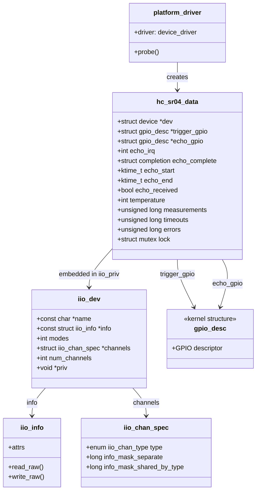
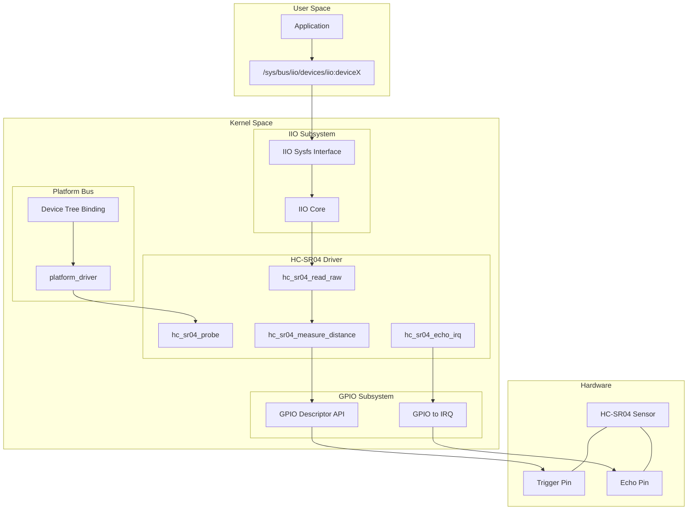
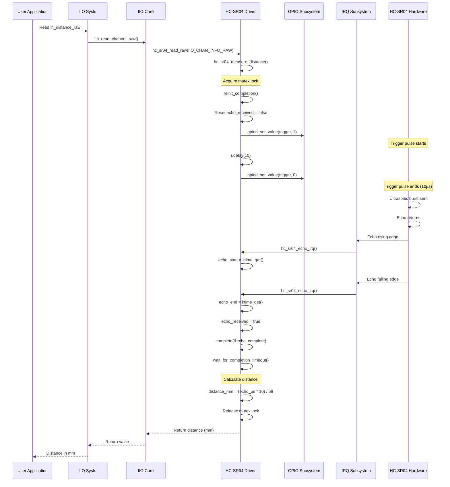
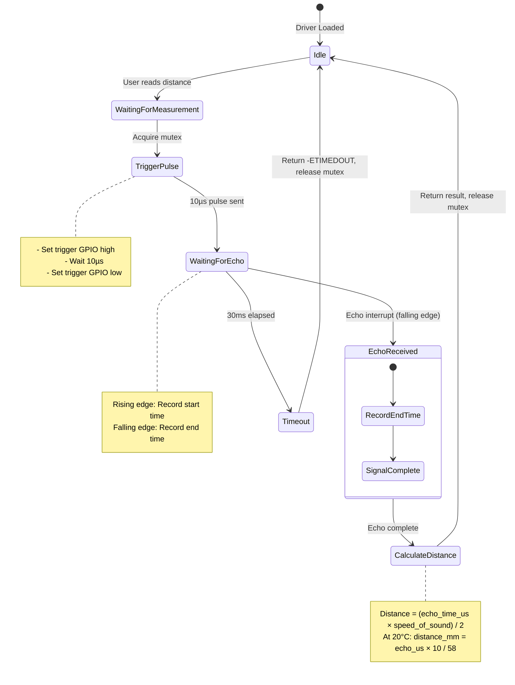
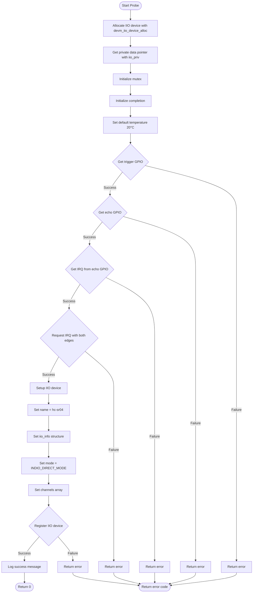
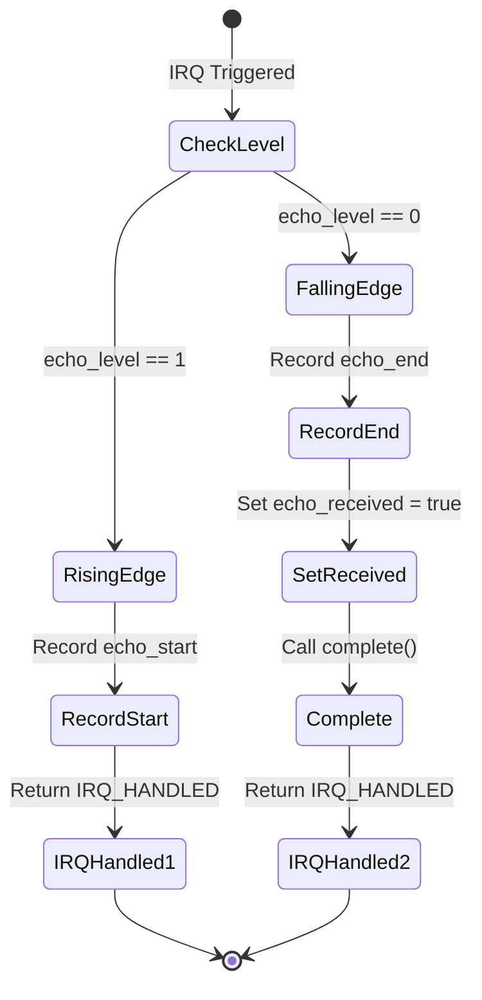
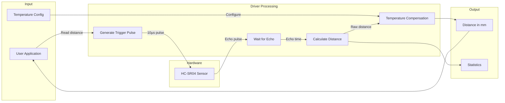
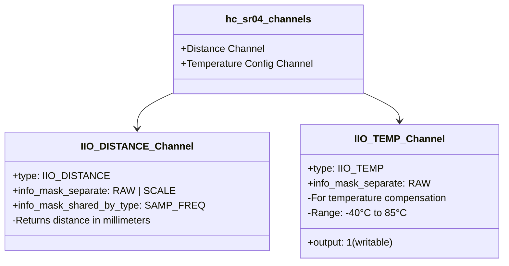
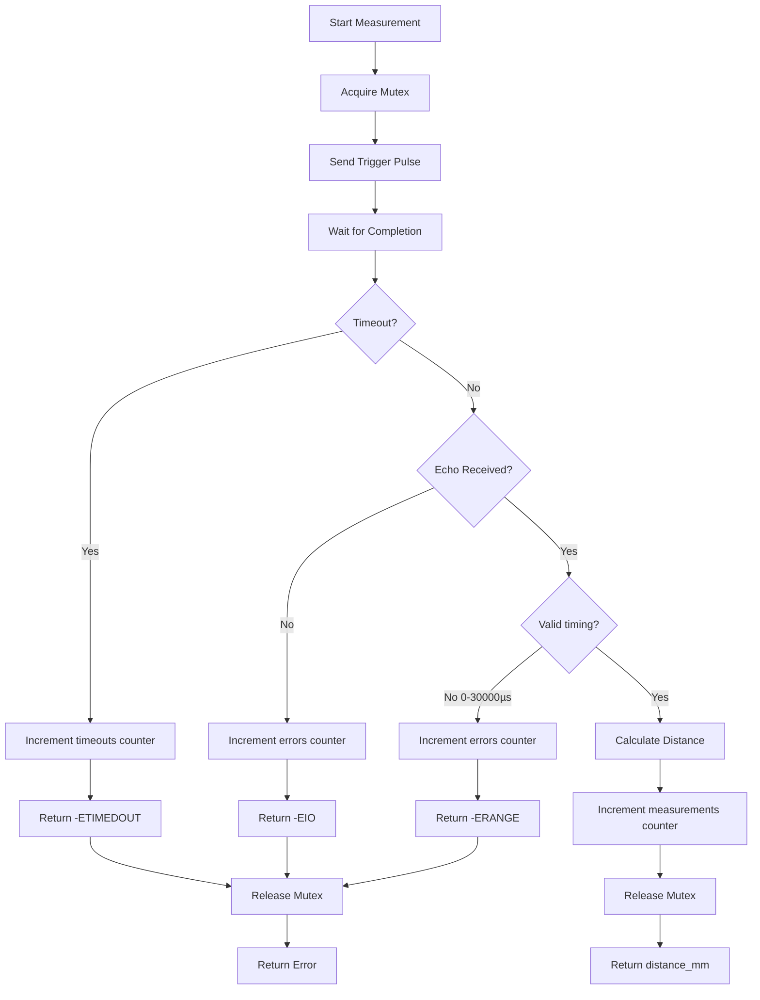

# HC-SR04 Ultrasonic Distance Sensor Driver - UML Documentation

## Overview

The HC-SR04 driver is a GPIO-based Platform Device Driver that integrates with the Linux IIO (Industrial I/O) subsystem to provide distance measurement functionality.

**Driver Type:** GPIO-based IIO Platform Driver
**File:** `drivers/sensors/ultrasonic/hc_sr04.c`
**Subsystems:** GPIO, IIO, IRQ, ktime

---

## 1. Class Diagram (Data Structures)



---

## 2. Component Diagram (Subsystem Integration)



---

## 3. Sequence Diagram (Distance Measurement)



---

## 4. State Machine Diagram (Measurement States)



---

## 5. Activity Diagram (Probe Function)



---

## 6. Timing Diagram (Measurement Timing)

```
                    10µs
                   |←→|
    Trigger Pin _____|‾‾‾|_______________________________________________
                     ↑
                     Trigger pulse start

                              Variable (proportional to distance)
                         |←─────────────────────→|
    Echo Pin    _________|‾‾‾‾‾‾‾‾‾‾‾‾‾‾‾‾‾‾‾‾‾‾|_______________________
                         ↑                       ↑
                    Rising edge              Falling edge
                   (echo_start)              (echo_end)

    Time        ─────────┬───────────────────────┬─────────────→
                         t1                      t2

    Echo Duration = t2 - t1 (in microseconds)
    Distance (cm) = Echo Duration / 58
    Distance (mm) = Echo Duration × 10 / 58

    Maximum range: ~4 meters (echo timeout: 30ms)
    Minimum range: ~2 cm
```

---

## 7. IRQ Handler State Diagram



---

## 8. Data Flow Diagram



---

## 9. IIO Channel Structure



---

## 10. Error Handling Flow



---

## 11. Device Tree Binding

```
Device Tree Structure:

ultrasonic-sensor {
    compatible = "hc-sr04", "elecfreaks,hc-sr04";
    trigger-gpios = <&gpio 17 GPIO_ACTIVE_HIGH>;
    echo-gpios = <&gpio 27 GPIO_ACTIVE_HIGH>;
};

┌─────────────────────────────────────────────┐
│              Device Tree Node               │
├─────────────────────────────────────────────┤
│  compatible: "hc-sr04"                      │
│                                             │
│  ┌─────────────────┐   ┌─────────────────┐  │
│  │  trigger-gpios  │   │   echo-gpios    │  │
│  │   GPIO Output   │   │   GPIO Input    │  │
│  │   Active High   │   │   Active High   │  │
│  └────────┬────────┘   └────────┬────────┘  │
│           │                     │           │
└───────────┼─────────────────────┼───────────┘
            │                     │
            ▼                     ▼
    ┌───────────────────────────────────┐
    │          HC-SR04 Sensor           │
    │   ┌───────┐         ┌───────┐     │
    │   │ TRIG  │         │ ECHO  │     │
    │   └───────┘         └───────┘     │
    │         ┌───────────────┐         │
    │         │  Ultrasonic   │         │
    │         │  Transducers  │         │
    │         └───────────────┘         │
    └───────────────────────────────────┘
```

---

## 12. Physics of Operation

```
Speed of Sound Calculation:

v = 331.3 + 0.606 × T (m/s)

Where T = temperature in °C

At 20°C:
v = 331.3 + 0.606 × 20 = 343.42 m/s = 0.03434 cm/µs

Distance Calculation:

       Echo Time (µs) × Speed of Sound (cm/µs)
Distance = ─────────────────────────────────────
                          2

For 20°C (simplified):
Distance (cm) = Echo Time (µs) / 58
Distance (mm) = Echo Time (µs) × 10 / 58

Temperature Compensation in Driver:
┌──────────────────────────────────────────────┐
│  speed = 3313 + 6 × temp_c  (0.1 m/s units)  │
│  distance_mm = (echo_us × speed) / 20000     │
└──────────────────────────────────────────────┘
```

---

## Summary

The HC-SR04 driver demonstrates:

1. **GPIO Integration** - Using GPIO descriptor API for trigger/echo pins
2. **Interrupt Handling** - Both-edge triggered IRQ for echo measurement
3. **IIO Subsystem** - Standard sensor interface for userspace
4. **High-Resolution Timing** - Using ktime for microsecond accuracy
5. **Synchronization** - Mutex and completion primitives
6. **Error Handling** - Timeout and validation with statistics
7. **Device Tree** - Platform device binding and configuration
