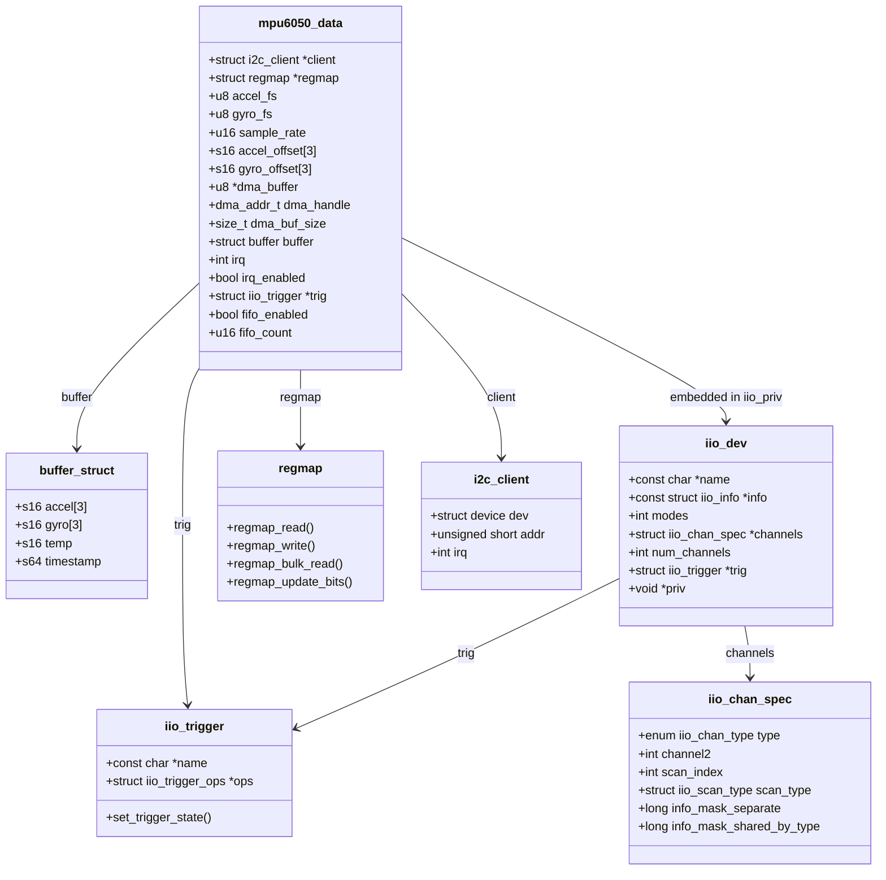
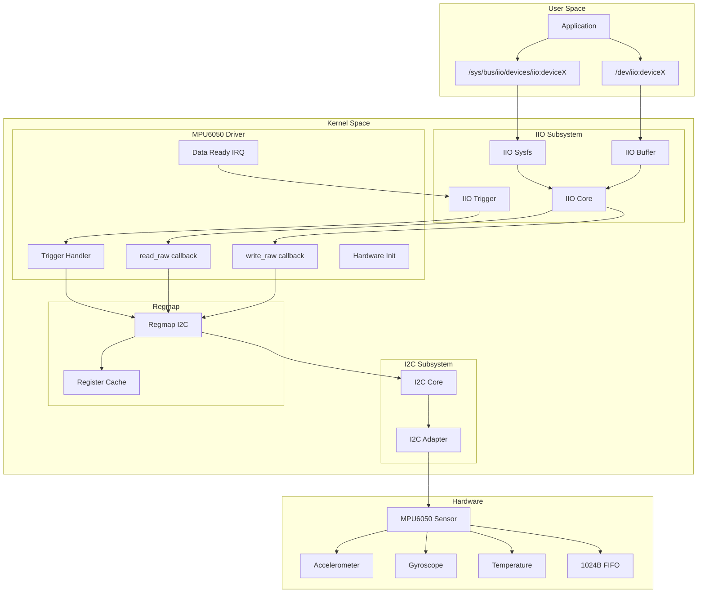
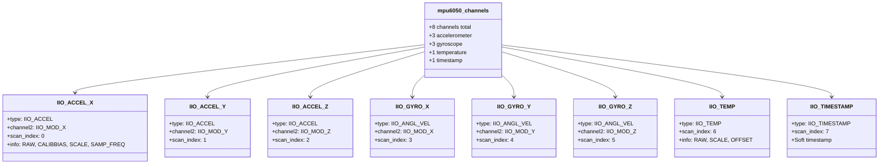
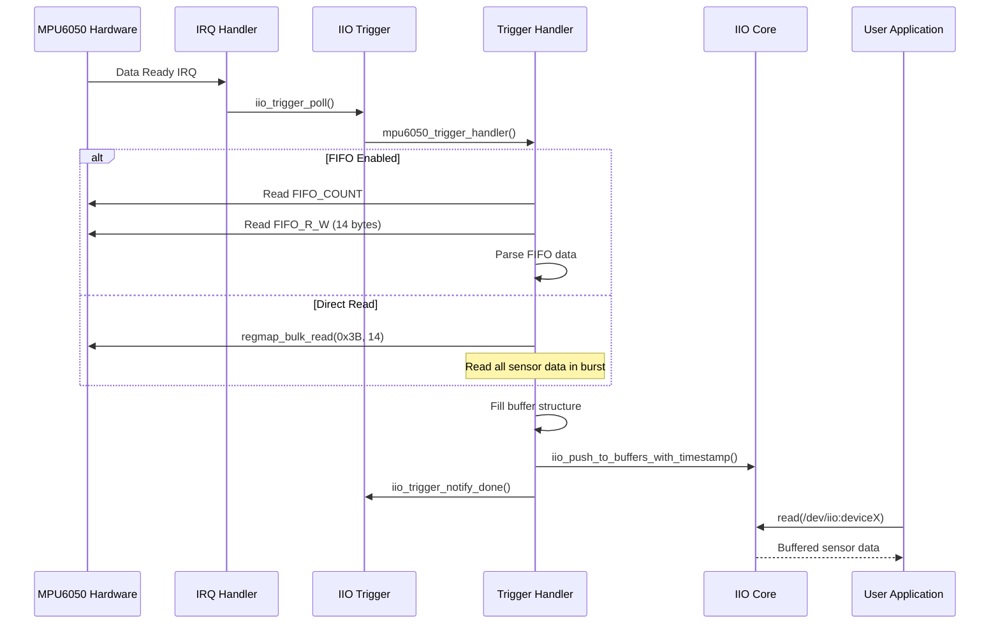
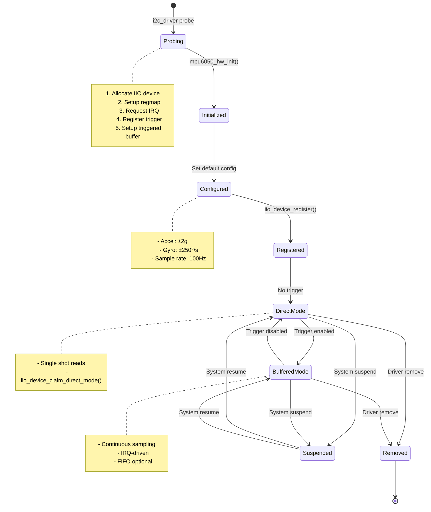
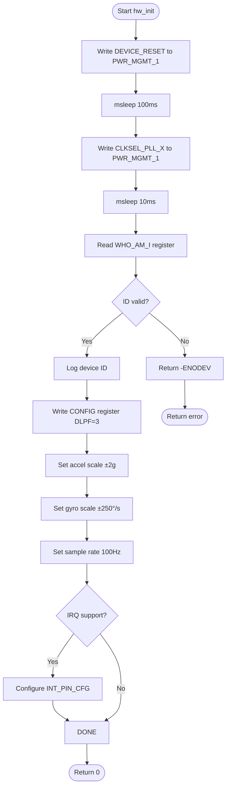
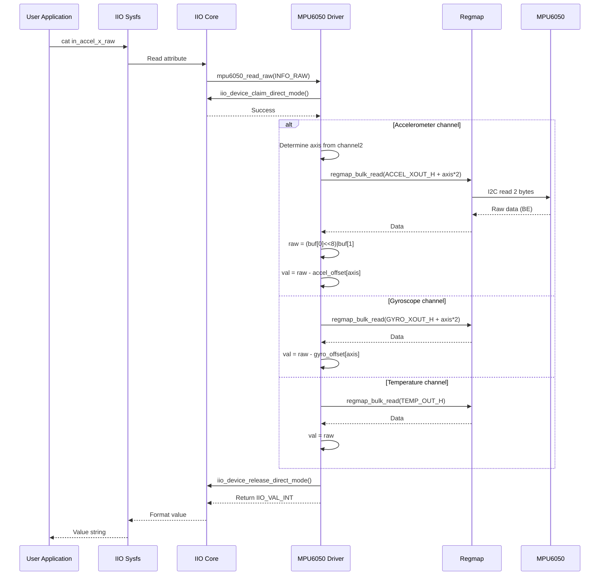
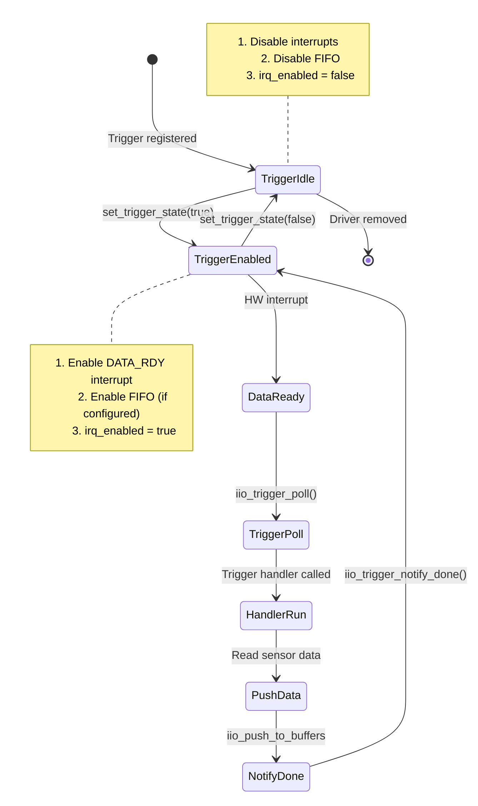

# MPU6050 IMU Driver - UML Documentation

## Overview

The MPU6050 driver is an I2C client driver that integrates with the Linux IIO (Industrial I/O) subsystem to provide 6-axis motion tracking (accelerometer + gyroscope) and temperature sensing functionality.

**Driver Type:** I2C Client IIO Driver
**File:** `drivers/sensors/mpu6050/mpu6050.c`
**Subsystems:** I2C, IIO, Regmap, Triggered Buffer, PM Runtime

---

## 1. Class Diagram (Data Structures)



---

## 2. Component Diagram (System Architecture)



---

## 3. Register Map Diagram

```
MPU6050 Register Map:

Address  Name              Description
─────────────────────────────────────────────────────────
0x19     SMPLRT_DIV       Sample Rate Divider
0x1A     CONFIG           Configuration (DLPF, EXT_SYNC)
0x1B     GYRO_CONFIG      Gyroscope Configuration (FS_SEL)
0x1C     ACCEL_CONFIG     Accelerometer Configuration (AFS_SEL)
0x23     FIFO_EN          FIFO Enable
0x37     INT_PIN_CFG      Interrupt Pin Configuration
0x38     INT_ENABLE       Interrupt Enable
0x3A     INT_STATUS       Interrupt Status
0x3B-40  ACCEL_XOUT_H/L   Accelerometer X, Y, Z (6 bytes)
0x41-42  TEMP_OUT_H/L     Temperature (2 bytes)
0x43-48  GYRO_XOUT_H/L    Gyroscope X, Y, Z (6 bytes)
0x6A     USER_CTRL        User Control (FIFO_EN, FIFO_RST)
0x6B     PWR_MGMT_1       Power Management 1
0x6C     PWR_MGMT_2       Power Management 2
0x72-73  FIFO_COUNT_H/L   FIFO Count
0x74     FIFO_R_W         FIFO Read/Write
0x75     WHO_AM_I         Device ID (0x68)

┌─────────────────────────────────────────────────────────┐
│                    GYRO_CONFIG (0x1B)                   │
├─────┬─────┬───────────┬─────────────────────────────────┤
│ 7:5 │ 4:3 │    2:0    │                                 │
├─────┼─────┼───────────┼─────────────────────────────────┤
│ XG  │ FS  │  Reserved │                                 │
│ ST  │ SEL │           │                                 │
├─────┴─────┴───────────┴─────────────────────────────────┤
│  FS_SEL: 00=±250°/s, 01=±500, 10=±1000, 11=±2000        │
└─────────────────────────────────────────────────────────┘

┌─────────────────────────────────────────────────────────┐
│                   ACCEL_CONFIG (0x1C)                   │
├─────┬─────┬───────────┬─────────────────────────────────┤
│ 7:5 │ 4:3 │    2:0    │                                 │
├─────┼─────┼───────────┼─────────────────────────────────┤
│ XA  │ AFS │  Reserved │                                 │
│ ST  │ SEL │           │                                 │
├─────┴─────┴───────────┴─────────────────────────────────┤
│  AFS_SEL: 00=±2g, 01=±4g, 10=±8g, 11=±16g               │
└─────────────────────────────────────────────────────────┘

┌─────────────────────────────────────────────────────────┐
│                    PWR_MGMT_1 (0x6B)                    │
├─────┬─────┬─────┬─────┬─────┬───────────────────────────┤
│  7  │  6  │  5  │  4  │  3  │        2:0                │
├─────┼─────┼─────┼─────┼─────┼───────────────────────────┤
│ RST │SLEEP│CYCLE│ --- │TEMP │       CLKSEL              │
│     │     │     │     │ DIS │                           │
├─────┴─────┴─────┴─────┴─────┴───────────────────────────┤
│  CLKSEL: 001 = PLL with X Gyro reference (recommended)  │
└─────────────────────────────────────────────────────────┘

Data Register Layout (0x3B - 0x48):
┌────────┬────────┬────────┬────────┬────────┬────────┬────────┐
│ACCEL_X │ACCEL_Y │ACCEL_Z │  TEMP  │ GYRO_X │ GYRO_Y │ GYRO_Z │
│ H | L  │ H | L  │ H | L  │ H | L  │ H | L  │ H | L  │ H | L  │
├────────┴────────┴────────┴────────┴────────┴────────┴────────┤
│  14 bytes total, all big-endian 16-bit signed values         │
└──────────────────────────────────────────────────────────────┘
```

---

## 4. IIO Channel Structure



---

## 5. Sequence Diagram (Triggered Buffer Read)



---

## 6. State Machine (Driver States)



---

## 7. Activity Diagram (Hardware Initialization)



---

## 8. Scale Tables and Conversions

```
Accelerometer Scale (m/s²):

┌────────────┬────────────┬───────────────┬────────────────────┐
│  AFS_SEL   │   Range    │ Sensitivity   │ Scale (µm/s²/LSB)  │
├────────────┼────────────┼───────────────┼────────────────────┤
│     0      │   ±2g      │  16384 LSB/g  │       598          │
│     1      │   ±4g      │   8192 LSB/g  │      1197          │
│     2      │   ±8g      │   4096 LSB/g  │      2394          │
│     3      │   ±16g     │   2048 LSB/g  │      4788          │
└────────────┴────────────┴───────────────┴────────────────────┘

Conversion: accel_m_s2 = raw_value × scale × 1e-6

Gyroscope Scale (rad/s):

┌────────────┬────────────┬───────────────┬────────────────────┐
│  FS_SEL    │   Range    │ Sensitivity   │ Scale (µrad/s/LSB) │
├────────────┼────────────┼───────────────┼────────────────────┤
│     0      │  ±250°/s   │  131 LSB/°/s  │       133          │
│     1      │  ±500°/s   │  65.5 LSB/°/s │       266          │
│     2      │  ±1000°/s  │  32.8 LSB/°/s │       532          │
│     3      │  ±2000°/s  │  16.4 LSB/°/s │      1065          │
└────────────┴────────────┴───────────────┴────────────────────┘

Conversion: gyro_rad_s = raw_value × scale × 1e-6

Temperature:
    Temp (°C) = (raw_value / 340.0) + 36.53
    Scale: 2941 µ°C/LSB
    Offset: 12420 (raw value for 0°C)

Sample Rate:
    Sample Rate = 1000 / (1 + SMPLRT_DIV) Hz
    SMPLRT_DIV = (1000 / desired_rate) - 1
```

---

## 9. FIFO Operation Flow

```mermaid
flowchart TD
    subgraph Enable["FIFO Enable"]
        E_START([Enable FIFO]) --> RESET[Write FIFO_RST to USER_CTRL]
        RESET --> CONFIG[Write FIFO_EN register]
        note right of CONFIG
            Enable sensors:
            - TEMP_FIFO_EN
            - XG/YG/ZG_FIFO_EN
            - ACCEL_FIFO_EN
        end note
        CONFIG --> ENABLE[Set FIFO_EN in USER_CTRL]
        ENABLE --> E_DONE([FIFO Running])
    end

    subgraph Read["FIFO Read"]
        R_START([Read FIFO]) --> COUNT[Read FIFO_COUNT_H/L]
        COUNT --> CHECK{Count >= 14?}
        CHECK -->|No| R_WAIT([Wait for data])
        CHECK -->|Yes| READ[Read FIFO_R_W × 14]
        READ --> PARSE[Parse sensor data]
        PARSE --> R_DONE([Return data])
    end

    subgraph Disable["FIFO Disable"]
        D_START([Disable FIFO]) --> CLR_EN[Clear FIFO_EN in USER_CTRL]
        CLR_EN --> CLR_CFG[Write 0 to FIFO_EN register]
        CLR_CFG --> D_DONE([FIFO Stopped])
    end
```

---

## 10. Sequence Diagram (read_raw Callback)



---

## 11. Trigger Control State Machine



---

## 12. Data Buffer Layout

```
Triggered Buffer Data Layout:

Scan Index:  0      1      2      3      4      5      6      7
           ┌──────┬──────┬──────┬──────┬──────┬──────┬──────┬──────────┐
           │ACC_X │ACC_Y │ACC_Z │GYR_X │GYR_Y │GYR_Z │ TEMP │TIMESTAMP │
           │ s16  │ s16  │ s16  │ s16  │ s16  │ s16  │ s16  │   s64    │
           │(BE)  │(BE)  │(BE)  │(BE)  │(BE)  │(BE)  │(BE)  │          │
           └──────┴──────┴──────┴──────┴──────┴──────┴──────┴──────────┘
Offset:     0      2      4      6      8      10     12     16
Size:       2B     2B     2B     2B     2B     2B     2B     8B

Total buffer size: 24 bytes (aligned to 8 bytes for timestamp)

struct buffer {
    s16 accel[3];       // Bytes 0-5
    s16 gyro[3];        // Bytes 6-11
    s16 temp;           // Bytes 12-13
    // 2 bytes padding  // Bytes 14-15
    s64 timestamp;      // Bytes 16-23 (8-byte aligned)
} __aligned(8);

scan_type for motion channels:
    .sign = 's'           // Signed
    .realbits = 16        // 16-bit resolution
    .storagebits = 16     // Stored in 16 bits
    .endianness = IIO_BE  // Big-endian from sensor
```

---

## 13. Power Management Flow

```mermaid
flowchart TD
    subgraph Suspend["System Suspend"]
        S_START([Suspend]) --> DISABLE_TRIG[Disable trigger]
        DISABLE_TRIG --> DISABLE_IRQ[Disable IRQ]
        DISABLE_IRQ --> SLEEP[Write SLEEP bit to PWR_MGMT_1]
        SLEEP --> S_DONE([Suspended])
    end

    subgraph Resume["System Resume"]
        R_START([Resume]) --> WAKE[Clear SLEEP bit]
        WAKE --> WAIT[msleep for stabilization]
        WAIT --> RESTORE[Restore configuration]
        RESTORE --> ENABLE_IRQ[Enable IRQ if was enabled]
        ENABLE_IRQ --> R_DONE([Resumed])
    end

    subgraph RuntimePM["Runtime PM"]
        PM_IDLE([Idle]) --> PM_SUSPEND[pm_runtime_suspend]
        PM_SUSPEND --> PM_LOW[Low power mode]
        PM_LOW --> PM_RESUME[pm_runtime_resume]
        PM_RESUME --> PM_ACTIVE[Full power]
        PM_ACTIVE --> PM_IDLE
    end
```



---

## 14. Kconfig Options

```mermaid
flowchart TD
    subgraph KConfig["Kconfig Options"]
        BASE[CONFIG_MPU6050<br/>Enable driver - tristate]

        BASE --> IRQ[CONFIG_MPU6050_IRQ<br/>Interrupt support]
        BASE --> DEBUG[CONFIG_MPU6050_DEBUG<br/>Debug output]

        IRQ --> TRIGGER[CONFIG_MPU6050_TRIGGER<br/>Hardware trigger]
        TRIGGER --> FIFO[CONFIG_MPU6050_FIFO<br/>FIFO buffering]

        BASE --> DMA[CONFIG_MPU6050_DMA<br/>DMA buffer support]
        DMA --> DMA_SIZE[CONFIG_MPU6050_DMA_BUFFER_SIZE<br/>Buffer size - int]
    end

    subgraph Features["Feature Matrix"]
        F_TABLE[
            Feature | Requires
            --------|----------
            Polled read | Base only
            Triggered buffer | IRQ + TRIGGER
            FIFO mode | IRQ + TRIGGER + FIFO
            DMA transfers | DMA
            Debug prints | DEBUG
        ]
    end
```

---

## 15. Device Tree Binding

```
Device Tree Example:

&i2c1 {
    status = "okay";

    mpu6050@68 {
        compatible = "invensense,mpu6050";
        reg = <0x68>;
        interrupt-parent = <&gpio>;
        interrupts = <25 IRQ_TYPE_EDGE_RISING>;
        mount-matrix = "1", "0", "0",
                       "0", "1", "0",
                       "0", "0", "1";
    };
};

┌─────────────────────────────────────────────────────────┐
│                    Device Tree Node                     │
├─────────────────────────────────────────────────────────┤
│  Parent: I2C bus controller node                        │
│  Compatible strings:                                    │
│    - "invensense,mpu6050"                               │
│    - "invensense,mpu6500"                               │
│    - "invensense,mpu9250"                               │
│                                                         │
│  ┌─────────────────┬───────────────────────────────┐    │
│  │   Property      │  Description                  │    │
│  ├─────────────────┼───────────────────────────────┤    │
│  │  reg            │  I2C address (0x68 or 0x69)   │    │
│  │  interrupts     │  Data ready IRQ              │    │
│  │  mount-matrix   │  Orientation matrix          │    │
│  └─────────────────┴───────────────────────────────┘    │
│                                                         │
│  WHO_AM_I Values:                                       │
│  - 0x68: MPU6050                                        │
│  - 0x70: MPU6500                                        │
│  - 0x71: MPU9250                                        │
└─────────────────────────────────────────────────────────┘
```

---

## 16. Userspace Interface

```
Sysfs Interface (/sys/bus/iio/devices/iio:deviceX/):

├── in_accel_x_raw           # Raw accelerometer X
├── in_accel_y_raw           # Raw accelerometer Y
├── in_accel_z_raw           # Raw accelerometer Z
├── in_accel_scale           # Current accelerometer scale
├── in_accel_scale_available # Available scales
├── in_accel_x_calibbias     # X axis offset
├── in_accel_y_calibbias     # Y axis offset
├── in_accel_z_calibbias     # Z axis offset
├── in_anglvel_x_raw         # Raw gyroscope X
├── in_anglvel_y_raw         # Raw gyroscope Y
├── in_anglvel_z_raw         # Raw gyroscope Z
├── in_anglvel_scale         # Current gyroscope scale
├── in_anglvel_scale_available
├── in_anglvel_x_calibbias
├── in_anglvel_y_calibbias
├── in_anglvel_z_calibbias
├── in_temp_raw              # Raw temperature
├── in_temp_scale            # Temperature scale
├── in_temp_offset           # Temperature offset
├── sampling_frequency       # Current sample rate
├── buffer/
│   ├── enable               # Enable/disable buffer
│   ├── length               # Buffer size
│   └── watermark            # Watermark level
├── trigger/
│   └── current_trigger      # Current trigger name
└── scan_elements/
    ├── in_accel_x_en        # Enable X accel in buffer
    ├── in_accel_x_index     # Scan index
    ├── in_accel_x_type      # Data format (le:s16/16>>0)
    └── ...

Character Device (/dev/iio:deviceX):
- Read to get buffered sensor data
- Use iio_buffer_read() in userspace
```

---

## Summary

The MPU6050 driver demonstrates:

1. **I2C Integration** - I2C client driver with regmap
2. **IIO Subsystem** - Standard sensor interface
3. **Multiple Channels** - Accelerometer, gyroscope, temperature
4. **Triggered Buffering** - IRQ-driven data collection
5. **FIFO Support** - Hardware buffering option
6. **DMA Support** - Optional DMA buffer allocation
7. **Calibration** - Offset and scale configuration
8. **Power Management** - Sleep mode and runtime PM
9. **Device Tree** - Flexible hardware configuration
10. **Regmap Caching** - Efficient register access
