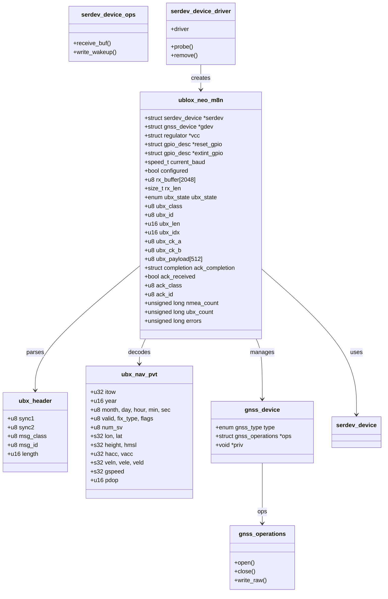
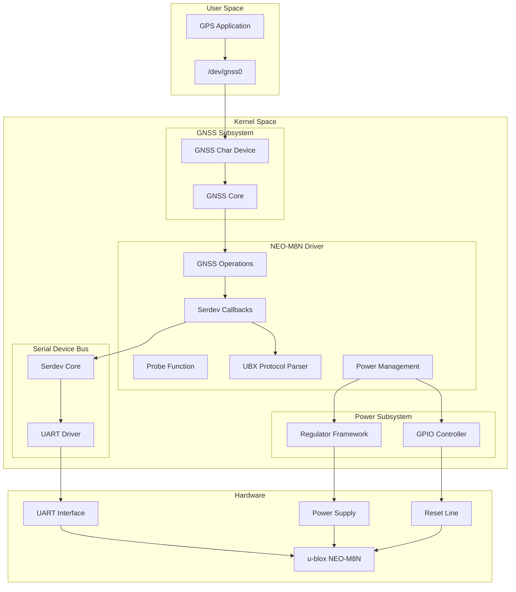
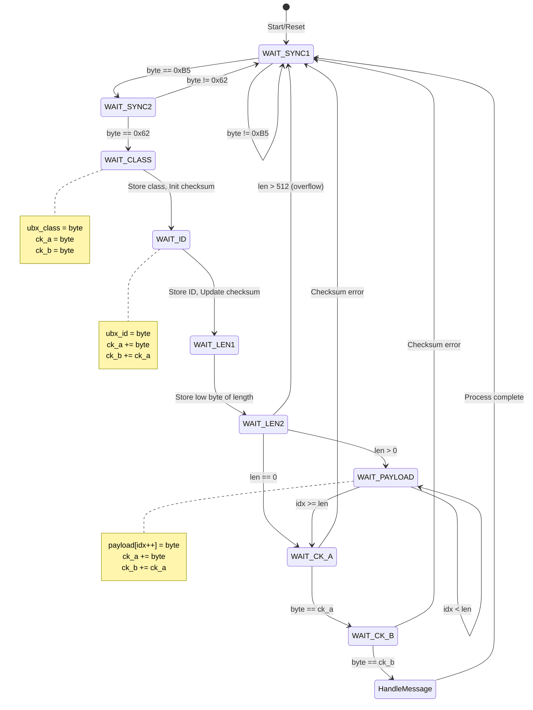
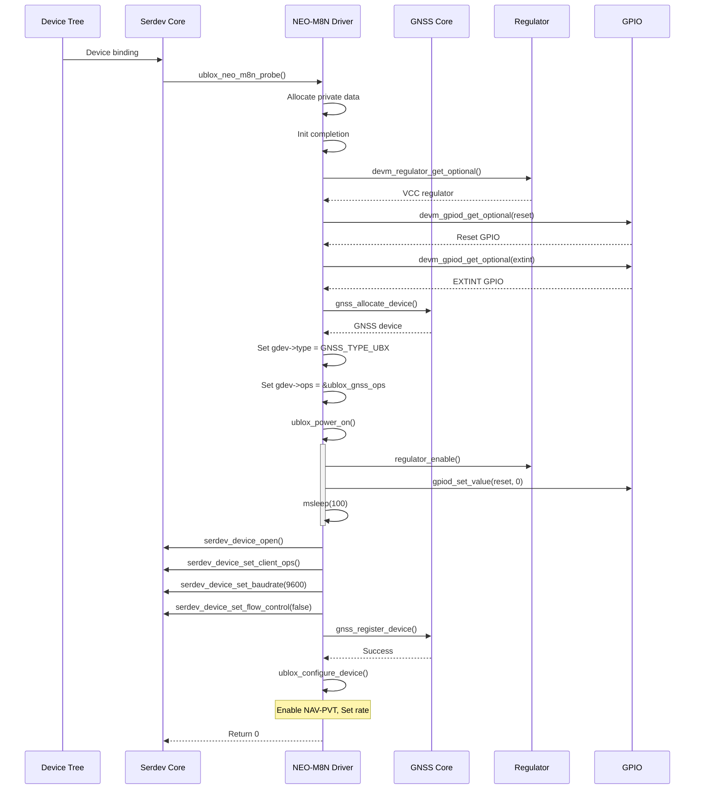
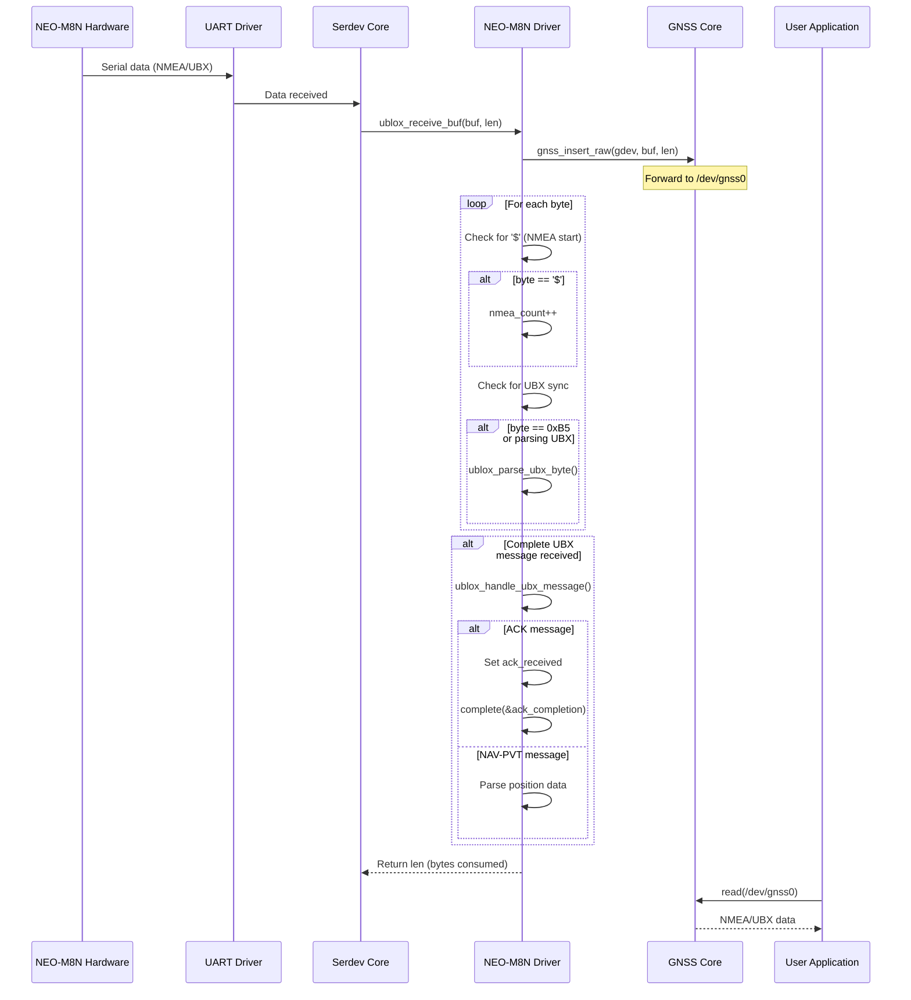
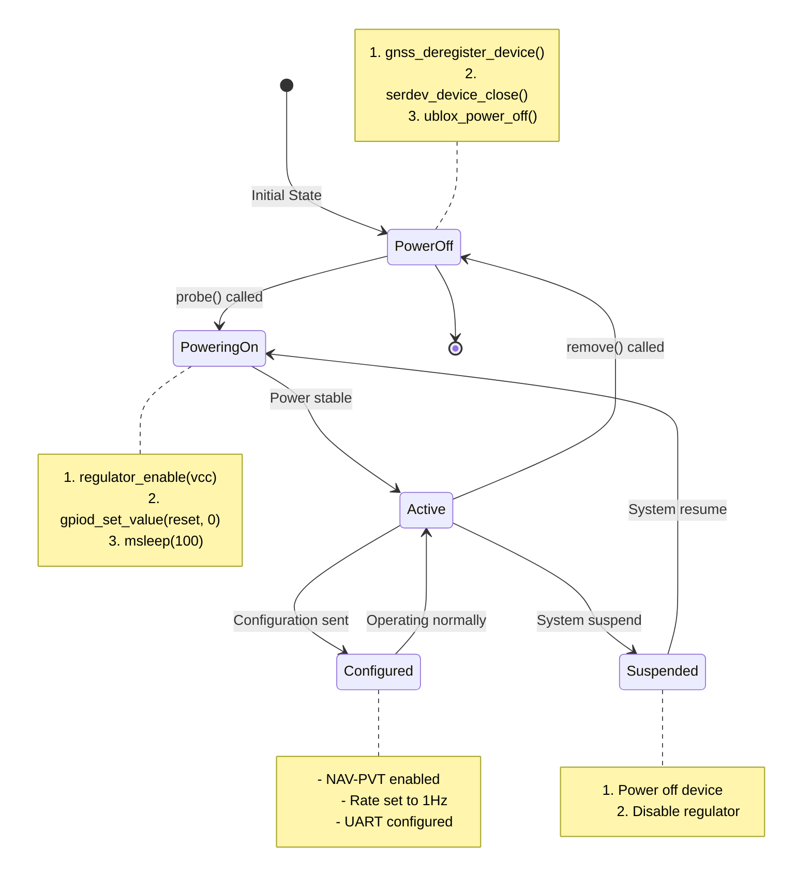
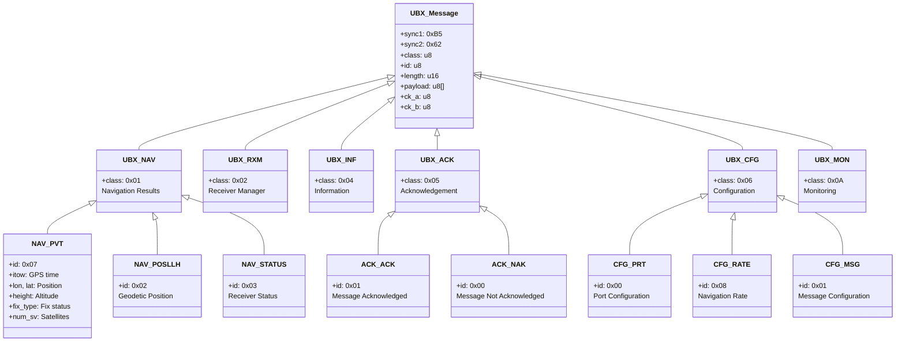
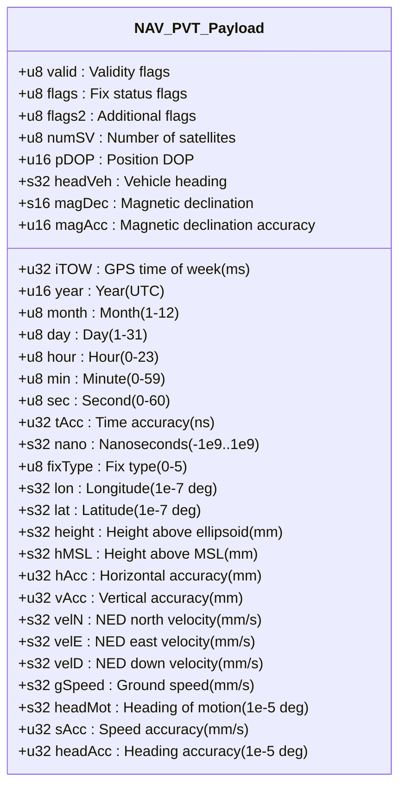
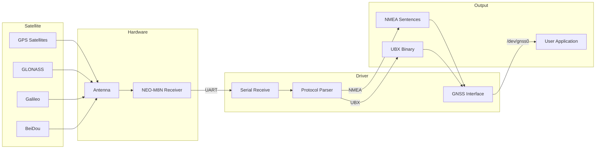
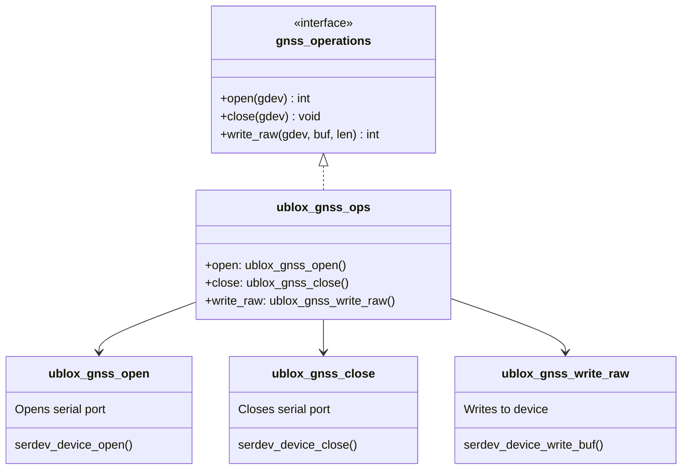

# u-blox NEO-M8N GPS/GNSS Driver - UML Documentation

## Overview

The NEO-M8N driver is a Serial Device Driver that integrates with the Linux GNSS subsystem to provide GPS/GLONASS/Galileo/BeiDou positioning functionality.

**Driver Type:** Serial Device (serdev) GNSS Driver
**File:** `drivers/gps/neo_m8n/ublox_neo_m8n.c`
**Subsystems:** GNSS, serdev, Regulator, GPIO, PM Runtime

---

## 1. Class Diagram (Data Structures)



---

## 2. Component Diagram (System Architecture)



---

## 3. UBX Protocol State Machine



---

## 4. Sequence Diagram (Device Initialization)



---

## 5. Sequence Diagram (Data Reception)



---

## 6. Activity Diagram (UBX Message Transmission)

```mermaid
flowchart TD
    START([Start Send UBX]) --> BUILD[Build UBX Message]

    BUILD --> SET_SYNC[Set sync bytes 0xB5, 0x62]
    SET_SYNC --> SET_CLASS[Set message class]
    SET_CLASS --> SET_ID[Set message ID]
    SET_ID --> SET_LEN[Set payload length]
    SET_LEN --> COPY_PAYLOAD[Copy payload data]

    COPY_PAYLOAD --> CALC_CK[Calculate checksum]
    note right of CALC_CK
        ck_a = ck_b = 0
        for each byte in class..payload:
            ck_a += byte
            ck_b += ck_a
    end note

    CALC_CK --> APPEND_CK[Append ck_a, ck_b]
    APPEND_CK --> SEND[serdev_device_write_buf()]

    SEND --> WAIT_ACK{Wait for ACK?}
    WAIT_ACK -->|No| DONE1([Return])

    WAIT_ACK -->|Yes| REINIT[reinit_completion()]
    REINIT --> WAIT[wait_for_completion_timeout()]

    WAIT --> TIMEOUT{Timeout?}
    TIMEOUT -->|Yes| RET_TIMEOUT[Return -ETIMEDOUT]

    TIMEOUT -->|No| CHECK_ACK{ACK received?}
    CHECK_ACK -->|Yes| RET_SUCCESS[Return 0]
    CHECK_ACK -->|No| RET_PROTO[Return -EPROTO]
```

---

## 7. Power Management State Diagram



---

## 8. UBX Message Class Hierarchy



---

## 9. UBX Frame Format

```
UBX Protocol Frame Structure:

┌──────┬──────┬───────┬────┬────────┬─────────────────┬──────┬──────┐
│ Sync │ Sync │ Class │ ID │ Length │    Payload      │ CK_A │ CK_B │
│  1   │  2   │       │    │(16-bit)│   (variable)    │      │      │
├──────┼──────┼───────┼────┼────────┼─────────────────┼──────┼──────┤
│ 0xB5 │ 0x62 │  1B   │ 1B │   2B   │   0-N bytes     │  1B  │  1B  │
└──────┴──────┴───────┴────┴────────┴─────────────────┴──────┴──────┘
         │              │                                │
         └──────────────┴─── Checksum calculated over ───┘
                             Class + ID + Length + Payload

Checksum Algorithm (Fletcher-8):
    ck_a = 0, ck_b = 0
    for byte in [class, id, length_lo, length_hi, payload...]:
        ck_a = (ck_a + byte) & 0xFF
        ck_b = (ck_b + ck_a) & 0xFF
```

---

## 10. NAV-PVT Message Structure



---

## 11. Data Flow Through Driver



---

## 12. Device Tree Binding

```
Device Tree Example:

&uart1 {
    status = "okay";

    gnss: gnss@0 {
        compatible = "u-blox,neo-m8n";
        vcc-supply = <&reg_3v3>;
        reset-gpios = <&gpio 5 GPIO_ACTIVE_LOW>;
        extint-gpios = <&gpio 6 GPIO_ACTIVE_HIGH>;
    };
};

┌─────────────────────────────────────────────────────┐
│                  Device Tree Node                   │
├─────────────────────────────────────────────────────┤
│  Parent: UART controller node                       │
│  Compatible strings:                                │
│    - "u-blox,neo-m8"                                │
│    - "u-blox,neo-m8n"                               │
│    - "u-blox,neo-m8m"                               │
│    - "u-blox,neo-m8q"                               │
│    - "u-blox,neo-m9n"                               │
│                                                     │
│  Properties:                                        │
│  ┌────────────────┬───────────────────────────┐     │
│  │  vcc-supply    │ Regulator for power       │     │
│  │  reset-gpios   │ Reset control (optional)  │     │
│  │  extint-gpios  │ External interrupt (opt)  │     │
│  └────────────────┴───────────────────────────┘     │
└─────────────────────────────────────────────────────┘
```

---

## 13. GNSS Operations Interface



---

## Summary

The NEO-M8N driver demonstrates:

1. **GNSS Subsystem Integration** - Standard kernel GNSS interface
2. **Serial Device (serdev)** - Modern serial port abstraction
3. **UBX Protocol Parsing** - Binary protocol state machine
4. **Power Management** - Regulator and GPIO control
5. **Multi-Protocol Support** - NMEA and UBX simultaneous handling
6. **ACK/NAK Handling** - Synchronous command confirmation
7. **Device Tree Configuration** - Flexible hardware binding
8. **Multi-Constellation Support** - GPS, GLONASS, Galileo, BeiDou
